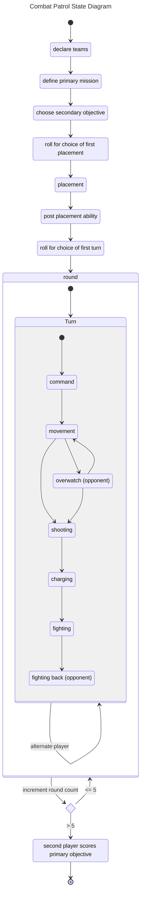

```mermaid
---
title: Combat Patrol State Diagram
---

stateDiagram-v2
%% start
1a: declare teams
1b: define primary mission
1c: choose secondary objective

[*] --> 1a
1a --> 1b
1b --> 1c

%% Deployment
2a: roll for choice of first placement
2b: placement
1c --> 2a
2a --> 2b

3a: post placement ability
3b: roll for choice of first turn
2b --> 3a
3a --> 3b
3b --> round

%% Rounds
state round {
    %% Turns
    [*] --> turn
    turn: Turn
    state turn {
        [*] --> 4a
        4a --> 4b
        4b --> 4c
        4c --> 4b
        4b --> 4d
        4c --> 4d
        4d --> 4e
        4e --> 4f
        4f --> 4g
        4a: command
        4b: movement
        4c: overwatch (opponent)
        4d: shooting
        4e: charging
        4f: fighting
        4g: fighting back (opponent)
    }
    turn --> turn : alternate player
}

5a: second player scores primary objective
state if_state <<choice>>
round --> if_state : increment round count
if_state --> round : <= 5
if_state --> 5a : > 5
5a --> [*]
```
