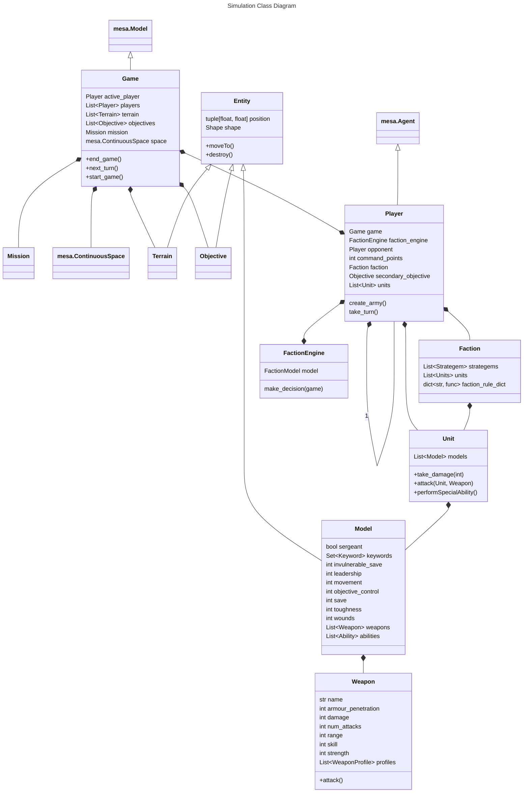

```mermaid
---
title: Simulation Class Diagram
---
classDiagram

class mesa.Model

mesa.Model <|-- Game

class Game {
    Player active_player
    List~Player~ players
    List~Terrain~ terrain
    List~Objective~ objectives
    Mission mission
    mesa.ContinuousSpace space

    +end_game()
    +next_turn()
    +start_game()
}

class Mission
class mesa.ContinuousSpace
class Terrain
class Objective

Game *-- Mission
Game *-- mesa.ContinuousSpace
Game *--* Player
Game *-- Terrain
Game *-- Objective

Entity <|-- Terrain
Entity <|-- Objective
Entity <|-- Model

class Entity {
    tuple[float, float] position
    Shape shape

    +moveTo()
    +destroy()
}

class mesa.Agent
mesa.Agent <|-- Player

class Player {
    %% model
    Game game

    %% engine
    FactionEngine faction_engine

    %% opponent
    Player opponent

    %% stats
    int command_points
    Faction faction
    Objective secondary_objective
    List~Unit~ units

    %% methods
    create_army()
    take_turn()
}

Player *-- Faction
Player *-- Unit
Player *-- Player : 1
Player *--* FactionEngine

class FactionEngine {
    FactionModel model

    make_decision(game)
}

class Faction {
    List~Strategem~ strategems
    List~Units~ units
    dict~str, func~ faction_rule_dict
}

Faction *-- Unit

class Unit {
    List~Model~ models

    +take_damage(int)
    +attack(Unit, Weapon)
    +performSpecialAbility()
}

Unit *-- Model

class Model {
    %% info
    bool sergeant
    Set~Keyword~ keywords

    %% stat line
    int invulnerable_save
    int leadership
    int movement
    int objective_control
    int save
    int toughness
    int wounds

    %% weapons
    List~Weapon~ weapons

    %% abilities
    List~Ability~ abilities
}

Model *-- Weapon

class Weapon {
    str name
    int armour_penetration
    int damage
    int num_attacks
    int range
    int skill
    int strength
    List~WeaponProfile~ profiles

    +attack()
}
```
