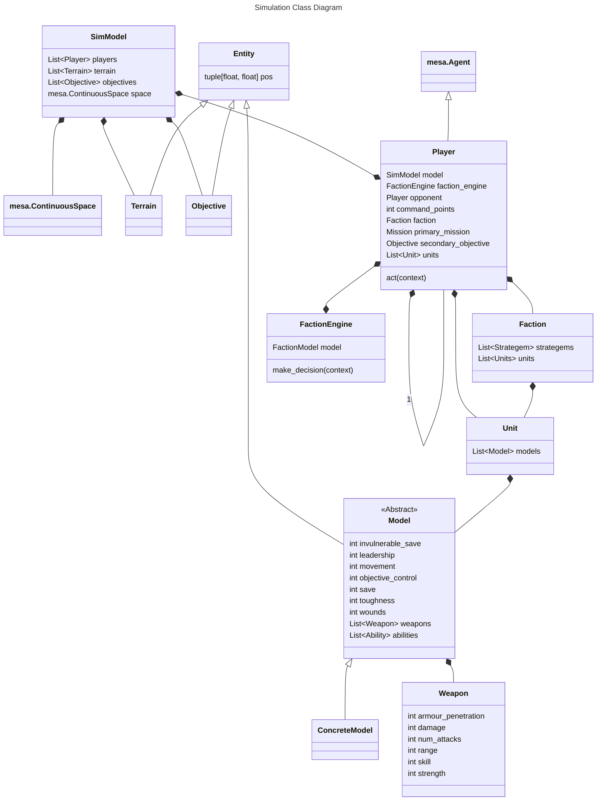

```mermaid
---
title: Simulation Class Diagram
---

classDiagram

class SimModel {
    List~Player~ players
    List~Terrain~ terrain
    List~Objective~ objectives
    mesa.ContinuousSpace space
}

class mesa.ContinuousSpace
class Terrain
class Objective

SimModel *-- mesa.ContinuousSpace
SimModel *--* Player
SimModel *-- Terrain
SimModel *-- Objective

Entity <|-- Terrain
Entity <|-- Objective
Entity <|-- Model

class Entity {
    tuple[float, float] pos
}

class mesa.Agent
mesa.Agent <|-- Player

class Player {
    %% model
    SimModel model

    %% engine
    FactionEngine faction_engine

    %% opponent
    Player opponent

    %% stats
    int command_points
    Faction faction
    Mission primary_mission
    Objective secondary_objective
    List~Unit~ units

    %% methods
    act(context)
}

Player *-- Faction
Player *-- Unit
Player *-- Player : 1
Player *--* FactionEngine

class FactionEngine {
    FactionModel model

    make_decision(context)
}

class Faction {
    List~Strategem~ strategems
    List~Units~ units
}

Faction *-- Unit

class Unit {
    List~Model~ models
}

Unit *-- Model

class Model {
    <<Abstract>>

    %% stat line
    int invulnerable_save
    int leadership
    int movement
    int objective_control
    int save
    int toughness
    int wounds

    %% weapons
    List~Weapon~ weapons

    %% abilities
    List~Ability~ abilities
}

Model <|-- ConcreteModel

Model *-- Weapon

class Weapon {
    int armour_penetration
    int damage
    int num_attacks
    int range
    int skill
    int strength
}
```
